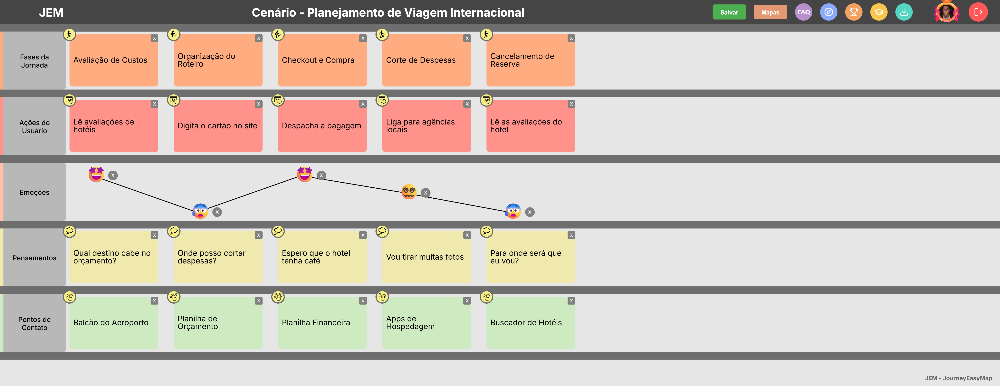

Entendi o que aconteceu! O ícone de imagem quebrada aparece geralmente por dois motivos: ou o repositório é privado (e aí o GitHub bloqueia links externos de `raw.githubusercontent.com` por segurança), ou o link com aquele código de versão longo acabou expirando ou não renderizando bem na pré-visualização.

Como a imagem já está salva dentro da pasta do seu próprio repositório, a maneira **mais segura, elegante e garantida** de fazer ela aparecer no `README.md` é usar o **caminho relativo**. Assim, o GitHub puxa a imagem diretamente da sua pasta local.

Aqui está o código completo corrigido (alterei o `src` da imagem para `./frontend/src/assets/mapa_mapa_de_jornada.png`):

***

# **JourneyEasyMap (JEM)** </img>

O **JourneyEasyMap (JEM)** é uma ferramenta de criação de Mapa de Jornada do Usuário (UJM), desenvolvida para um Trabalho de Conclusão de Curso na Universidade Federal de Alfenas <b>(UNIFAL-MG)</b>.

Esta ferramenta é uma adaptação do projeto original, disponível em: [https://github.com/GuilhermeHenq/EasyJourneyMap](https://github.com/GuilhermeHenq/EasyJourneyMap). 

Você pode acessar a versão adaptada **com gamificação** diretamente pelo link: **[https://tutor-rose.vercel.app/](https://tutor-rose.vercel.app/)**

- **Frontend**: Construído com React.JS e Vite, utilizando a biblioteca **React Konva** para manipulação avançada de formas e visualização.  
- **Backend**: Desenvolvido em Node.js com o framework **Express**, garantindo operações robustas e escaláveis no servidor.  
- **Banco de Dados**: Utiliza um banco de dados **MySQL**, com o schema `mapjourney` para armazenar e gerenciar todos os dados da aplicação.
- **Hospedagem / Infraestrutura**: O frontend está implantado na **Vercel** para garantir performance e entrega contínua, enquanto o backend e o banco de dados estão hospedados na **DigitalOcean**.

   
  <b>Figura 1. Exemplo de um Mapa de Jornada do Usuário na ferramenta JEM.</b>

---

Esperamos que você aproveite o JourneyEasyMap! Para dúvidas ou mais informações, entre em contato com a equipe de desenvolvimento:

✉ felipe.correa@sou.unifal-mg.edu.br
